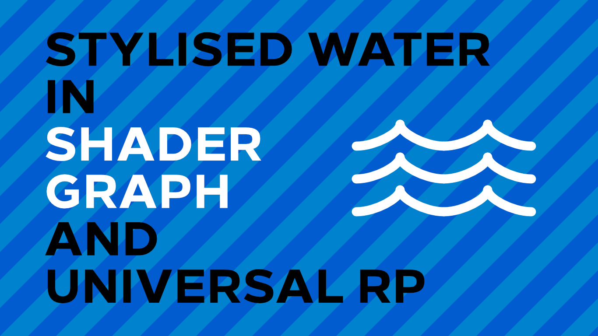

# Stylised Water in Unity URP

A stylised water shader for Unity's Universal Render Pipeline.

## Overview

This project contains a stylised water shader intended to show off some of the features of Shader Graph and Universal RP. An accompanying tutorial is available on [danielilett.com](https://danielilett.com/2020-04-05-tut5-3-urp-stylised-water/).

## Software

This project was created using Unity 2019.3.0f6 and Universal Render Pipeline 7.1.8.

## Authors

This project and the corresponding tutorial series were written by Daniel Ilett. [Follow him on Twitter](https://twitter.com/daniel_ilett) for more gamedev tutorials!

## Release

This project was released on April 5th 2020. 
